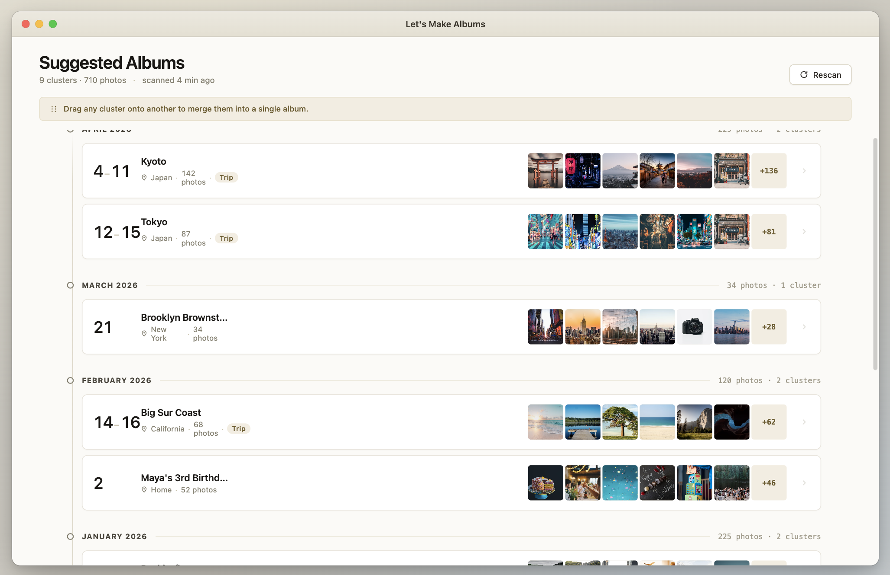

# LetsMakeAlbums

LetsMakeAlbums is a native macOS SwiftUI app that scans the local Photos library and suggests albums from unorganized image assets. It uses PhotoKit metadata, timestamps, and location heuristics. It does not use external AI models.



## What It Does

- Requests Photos read/write access.
- Scans image assets from the user's Photos library.
- Skips screenshots.
- Excludes photos already present in user-created albums.
- Groups remaining photos into suggested albums using time and location metadata.
- Lets the user preview every photo in a proposed album.
- Supports manual drag-and-drop merging of album suggestions.
- Reverse-geocodes photo locations for human-readable album names.
- Creates albums in Photos after user confirmation.

## Tech Stack

- Swift 6
- SwiftUI
- Observation framework with `@Observable`
- PhotoKit
- CoreLocation / CLGeocoder
- OSLog
- Xcode macOS app target

## Core Architecture

Primary flow:

```text
PHPhotoLibrary
  -> PhotoLibraryManager
  -> [PhotoCluster]
  -> ContentView grid
  -> ClusterDetailView
  -> PHPhotoLibrary.performChanges
```

Important files:

- `LetsMakeAlbums/Models/PhotoCluster.swift`: observable photo cluster model and computed smart album name.
- `LetsMakeAlbums/Services/PhotoLibraryManager.swift`: scanning, clustering, geocoding state, album creation, merge, and dismissal logic.
- `LetsMakeAlbums/Services/GeocoderThrottle.swift`: throttled reverse-geocoding actor.
- `LetsMakeAlbums/Support/ClusterFormatting.swift`: date and naming formatters.
- `LetsMakeAlbums/Views/ContentView.swift`: main suggestions grid.
- `LetsMakeAlbums/Views/ClusterDetailView.swift`: album preview, rename, and create flow.
- `LetsMakeAlbums/Views/ClusterCellView.swift`: suggestion card UI.
- `LetsMakeAlbums/Views/ThumbnailImageView.swift`: PhotoKit thumbnail loading.

## Build

```bash
xcodebuild -scheme LetsMakeAlbums -configuration Debug -quiet build
```

## Test

```bash
xcodebuild -scheme LetsMakeAlbums -configuration Debug test
```

For targeted local verification:

```bash
xcodebuild test \
  -project /Users/dorluzgarten/projects/LetsMakeAlbums/LetsMakeAlbums.xcodeproj \
  -scheme LetsMakeAlbums \
  -configuration Debug \
  -derivedDataPath /Users/dorluzgarten/projects/LetsMakeAlbums/build/DerivedData \
  -only-testing:LetsMakeAlbumsTests
```

## Run

```bash
./script/build_and_run.sh
```

With logs:

```bash
./script/build_and_run.sh --logs
```

## Permissions

The app requires Photos library read/write access to scan assets and create albums. Reverse geocoding requires network client access.

Relevant app capabilities and permissions:

- App Sandbox
- Photos library access
- Network client access for CLGeocoder
- Hardened Runtime

## Notes For Future Work

The `.prompts` folder contains reference guides for the major product decisions:

- Smart clustering
- Drag-and-drop merge
- Async geocoding and smart naming

Those files are local developer context and intentionally ignored by git.
